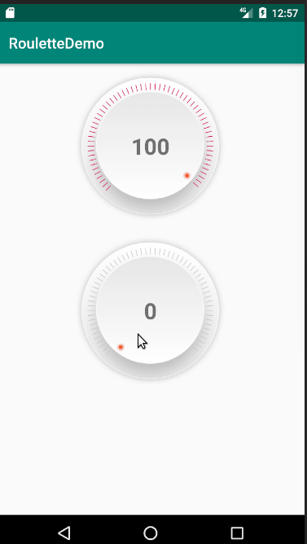

### 简介

- 经常遇到一些控件需求，需要跟随旋转手势计算进度，温度，数量等，所以就有了这个实现。希望能帮助朋友们实现类似的功能。

### 效果




### 声明
布局文件中声明：

```java
<com.liqi.roulettedemo.widget.CoreControlView
    android:id="@+id/c_view0"
    android:layout_width="200dp"
    android:layout_height="200dp" />

````